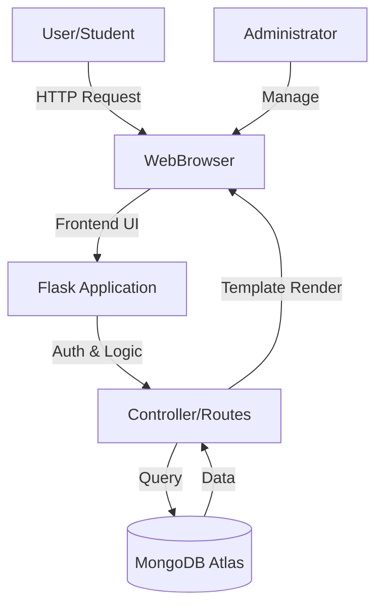
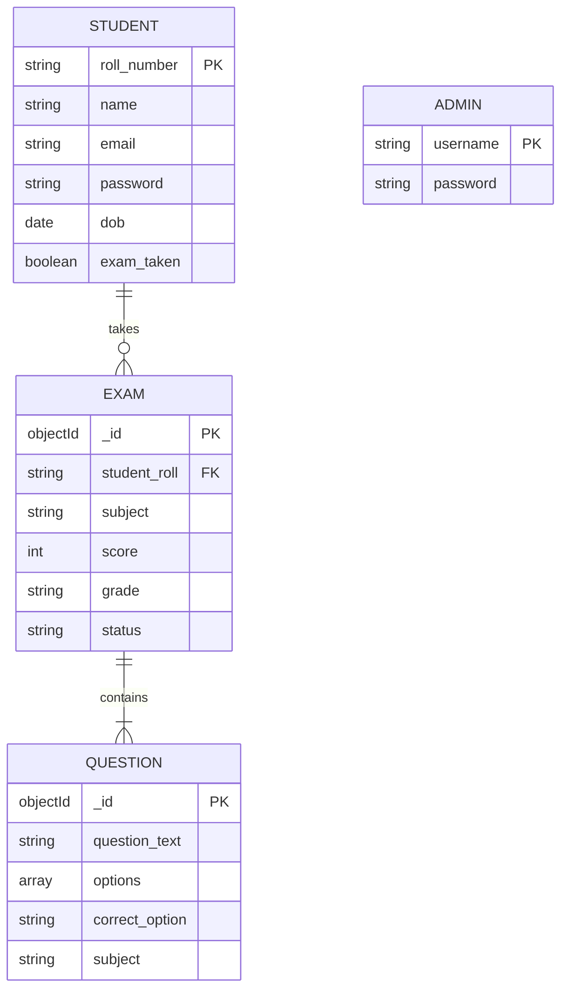

# PROJECT REPORT
# ON
# ONLINE EXAMINATION SYSTEM
## (O Level Exam Portal)

---

### Submitted By:
**Name:** Ravi Kumar  
**Roll No:** [Your Roll No]  
**Course:** [Your Course Name]  
**Subject:** Major Project  

### Submitted To:
**Department of Computer Science**  
**Oxford Group of Institution**  

### Session: 2024-2025

---

<div style="page-break-after: always;"></div>

## CERTIFICATE

This is to certify that **Ravi Kumar**, a student of **[Your Course]** at **Oxford Group of Institution**, has successfully completed the project titled **"Online Examination System"** under my supervision.

The project embodies the proper application of the concepts learned and is a record of bona fide work carried out by them.

<br><br><br>

___________________          ___________________
**Internal Guide**              **External Examiner**

<br><br>

___________________
**HOD, Computer Science**

<div style="page-break-after: always;"></div>

## ACKNOWLEDGEMENT

I would like to express my gratitude to my project guide and the faculty of the Department of Computer Science, **Oxford Group of Institution**, for their valuable guidance and support throughout the development of this project.

I also thank my parents and friends for their encouragement and assistance.

**Ravi Kumar**

<div style="page-break-after: always;"></div>

## TABLE OF CONTENTS

1.  **Introduction**
    *   1.1 Abstract
    *   1.2 Objectives
    *   1.3 Scope of the Project
2.  **System Analysis**
    *   2.1 Existing System
    *   2.2 Proposed System
    *   2.3 Feasibility Study
3.  **System Requirements**
    *   3.1 Hardware Requirements
    *   3.2 Software Requirements
    *   3.3 Technology Stack
4.  **System Design**
    *   4.1 System Architecture (DFD)
    *   4.2 Database Design (ER Diagram)
    *   4.3 Module Description
5.  **Implementation Details**
    *   5.1 Project Structure
    *   5.2 Core Code Logic (with Snippets)
    *   5.3 Key Algorithms
6.  **Testing**
    *   6.1 Unit Testing
    *   6.2 Integration Testing
    *   6.3 System Testing
7.  **Results and Output**
    *   7.1 User Interface Screenshots
8.  **Conclusion and Future Scope**
9.  **Bibliography**

<div style="page-break-after: always;"></div>


### 2.3 Feasibility Study
*   **Technical Feasibility**: The project uses Python (Flask) and MongoDB, which are robust and open-source technologies. The transition to a serverless architecture ensures high availability.
*   **Operational Feasibility**: The web interface is intuitive, requiring minimal training for users.
*   **Economic Feasibility**: Built using open-source tools (Python, MongoDB Atlas Free Tier, Vercel), making it highly cost-effective.

---

## 3. SYSTEM REQUIREMENTS

### 3.1 Hardware Requirements
*   **Processor**: Intel Core i3 or higher / AMD Ryzen 3.
*   **RAM**: 4GB or higher (8GB Recommended).
*   **Disk Space**: 1GB minimum.
*   **Internet Connection**: Required for database connectivity (MongoDB Atlas).

### 3.2 Software Requirements
*   **Operating System**: Windows 10/11, Linux, or macOS.
*   **Web Browser**: Google Chrome, Firefox, or Edge.
*   **Code Editor**: VS Code.
*   **Runtime**: Python 3.9+.

### 3.3 Technology Stack
*   **Frontend**: HTML5, CSS3 (Glassmorphism Design), JavaScript (Vanilla).
*   **Backend**: Python (Flask Framework).
*   **Database**: MongoDB (NoSQL Database).
*   **Deployment**: Vercel/Render (Cloud Hosting).

---

## 4. SYSTEM DESIGN

### 4.1 System Architecture

The system follows a typical Client-Server architecture. The client (Browser) sends requests to the Flask Server, which interacts with the MongoDB Database and returns HTML templates.



### 4.2 Database Design (ER Diagram)

The data is unstructured but strictly schema-enforced within the application. Below is the Entity-Relationship logic:



### 4.3 Module Description
*   **Authentication Module**: Uses secure sessions and password hashing (PBKDF2/SHA256) to ensure user security. It handles both Student and Admin login flows.
*   **Exam Engine**: Randomly selects questions from the database for each session using MongoDB's `$sample` aggregation, ensuring fairness. It includes a timer and auto-submit functionality.
*   **Result Module**: Calculates the percentage and assigns a grade based on standard NIELIT criteria (e.g., >85% = S Grade, 75-84% = A Grade).
*   **Dashboard**: Provides a visual summary of student progress and available actions.

---

## 5. IMPLEMENTATION DETAILS

### 5.1 Project Structure
The folder structure of the application is as follows:
```
dark-satellite/
├── app.py              # Main application entry point (Routes & Logic)
├── models.py           # Database Model Classes (Student, Exam, Question)
├── config.py           # Environment Configuration
├── utils.py            # Utility Functions (Hashing, Roll No Generation)
├── templates/          # HTML Templates (Jinja2)
│   ├── index.html      # Landing Page
│   ├── login.html      # Authentication
│   ├── dashboard.html  # Student Main Panel
│   ├── exam.html       # Question Interface
│   └── result.html     # Certificate Generation
├── static/             # Static Assets
│   ├── css/style.css   # Glassmorphism Styles
│   └── js/main.js      # Frontend Logic
└── requirements.txt    # Python Dependencies
```

### 5.2 Core Code Logic

#### Database Connection (Singleton Pattern)
We use a singleton pattern in `models.py` to ensure only one database connection is active, which is crucial for serverless deployments.

```python
class Database:
    _instance = None
    
    def __new__(cls):
        if cls._instance is None:
            cls._instance = super(Database, cls).__new__(cls)
        return cls._instance
```

#### Student Registration
When a student registers, we generate a unique Roll Number and hash their password before storage.

```python
# models.py
@staticmethod
def create(name, email, password, phone, dob):
    # ... checks for existing email ...
    student = {
        'roll_number': generate_roll_number(),
        'password': hash_password(password),
        # ... other fields ...
    }
    return db.students.insert_one(student)
```

#### Exam Submission & Grading
The grading logic is encapsulated in the `Exam` model to maintain consistency.

```python
# app.py snippet
percentage = (score / total_questions) * 100
if percentage >= 85: grade = 'S'
elif percentage >= 75: grade = 'A'
# ... etc ...
Exam.submit(student['roll_number'], score, total_questions, percentage, grade)
```

### 5.3 Key Algorithms
1.  **Random Question Selection**: Uses `db.questions.aggregate([{'$sample': {'size': 100}}])` to fetch unique random questions every time an exam starts.
2.  **Session Management**: Flask's `session` object is used to track the logged-in user state securely across requests.

---

## 6. TESTING

### 6.1 Unit Testing
*   **Authentication**: Verified that invalid passwords and non-existent users are rejected.
*   **Input Validation**: Verified that all form fields (Name, Email, DOB) are mandatory and correctly formatted.

### 6.2 Integration Testing
*   **Exam Flow**: Tested the complete flow from Student Dashboard -> Start Exam -> Submit -> Result Generation. confirmed that the result in the database matches the displayed result.
*   **Admin Actions**: Tested that deleting a student also removes their associated exam records (if implemented).

### 6.3 System Testing
*   **Browser Compatibility**: Tested on Chrome and Edge. The interface is responsive and works on Mobile devices.
*   **Performance**: The application loads under 2 seconds on standard 4G networks.

---

## 7. RESULTS AND OUTPUT

The project successfully delivers a functional exam portal.

### 7.1 User Interface Screenshots

**1. Login Page**
*(Paste screenshot of login page here)*
*Description: Secure login interface with typing animation.*

**2. Student Dashboard**
*(Paste screenshot of dashboard here)*
*Description: Displays student details and subject options.*

**3. Examination Screen**
*(Paste screenshot of exam page here)*
*Description: Real-time timer and question navigation.*

**4. Result / Certificate**
*(Paste screenshot of result page here)*
*Description: Official-style result sheet with automatic grading.*

---

## 8. CONCLUSION AND FUTURE SCOPE

### Conclusion
The **Online Examination System** meets the initial requirements of providing a computerized platform for O Level practice exams. It eliminates manual errors, speeds up the grading process, and offers a user-friendly interface for students. The use of modern web technologies ensures the application is fast, responsive, and secure.

### Future Scope
*   **AI Proctoring**: Integrating webcam support to monitor students during exams.
*   **Multi-language Support**: Adding support for Hindi and other regional languages.
*   **Advanced Analytics**: Providing graphical analysis of student performance over time.
*   **Mobile App**: Developing a native mobile application for easier access.

---

## 9. BIBLIOGRAPHY

*   **Books**: "Head First Python" by Paul Barry, "MongoDB: The Definitive Guide".
*   **Websites**: 
    *   Flask Documentation (flask.palletsprojects.com)
    *   MongoDB Atlas Docs (mongodb.com)
    *   W3Schools (HTML/CSS) for frontend references.
    *   StackOverflow for troubleshooting specific errors.

---
